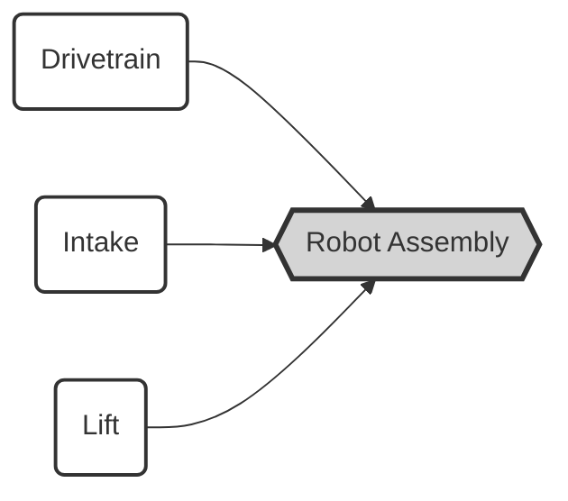
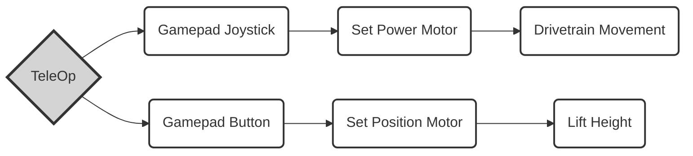

# Systems
### Implemented;
|Implemented|To Do  |
|--|--|
|  |SetPowerMotor() |
|  |SetPositionMotor() |
|  |PIDFMotor() |
|  |SetPowerServo() |
|  |SetPositionServo() |
|  |() |
|  |() |
|  |() |

## How it works
In CAD there are multiple different components are used in a full robot assembly.

We can achieve this same outcome in code by using separate classes for each commonly used subsystem of the robot.

